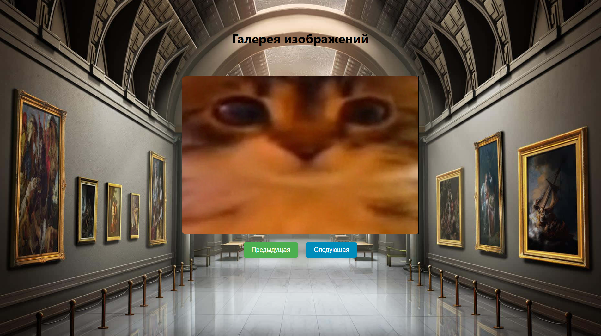
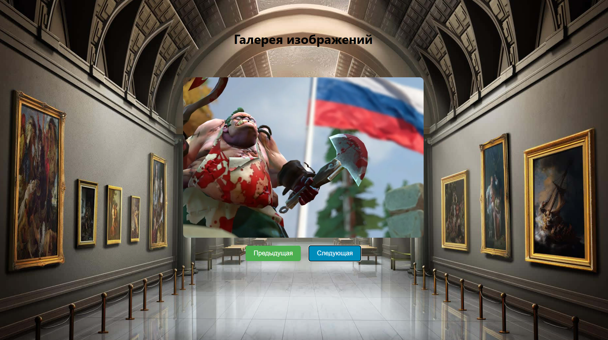
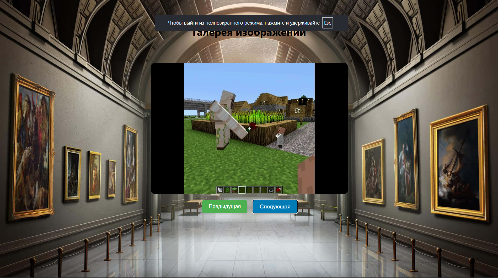
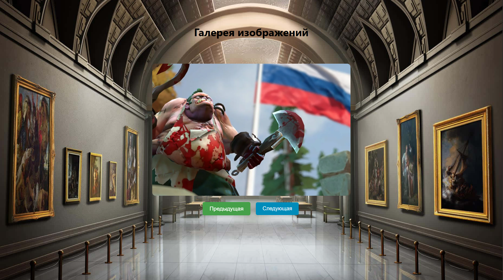

# Отчёт по проекту "Галерея изображений"

## Краткое описание приложения
React-приложение "Галерея изображений" - это интерактивная галерея для просмотра набора картинок с возможностью навигации между ними. Приложение имеет элегантный дизайн с тематическим фоном музея.

## Основные возможности
- Просмотр изображений в крупном формате
- Переключение между картинками с помощью кнопок "Предыдущая" и "Следующая"
- Циклическая навигация - после последнего изображения отображается первое
- Визуальные эффекты при наведении на кнопки

## Особенности реализации

### Использованные технологии:
- **React** с функциональными компонентами
- **Хук useState** для управления состоянием текущего изображения
- **CSS3** для стилизации и анимаций

### Ключевые аспекты кода:

```jsx
// Управление текущим изображением
const [currentIndex, setCurrentIndex] = useState(0);

// Навигация с циклическим переключением
const handlePrev = () => {
  setCurrentIndex(prev => (prev === 0 ? images.length - 1 : prev - 1));
};

const handleNext = () => {
  setCurrentIndex(prev => (prev === images.length - 1 ? 0 : prev + 1));
};
```

## Визуальные элементы

- **Динамический фон музея** - создает атмосферу художественной галереи
- **Стилизованные кнопки** с эффектами наведения - плавное изменение цвета и масштаба
- **Адаптивное расположение элементов** - центрирование контента на странице

## Демонстрация работы приложения

### Скриншот 1: Первое изображение

*Начальное состояние галереи с первым изображением*

### Скриншот 2: Второе изображение  

*Результат нажатия кнопки "Следующая"*

### Скриншот 3: Третье изображение

*Результат повторного нажатия кнопки "Следующая"*

### Скриншот 4: Возврат ко второму изображению

*Результат нажатия кнопки "Предыдущая"*

## Выводы

В ходе работы успешно разработано React-приложение, демонстрирующее:

- **Практическое применение React hooks для управления состоянием**
- **Реализацию интуитивной навигации между элементами** 
- **Основы современной веб-разработки на React**
- **Навыки работы с CSS для создания визуально привлекательного интерфейса**

Приложение полностью выполняет поставленную задачу по созданию интерактивной галереи изображений с удобной навигацией.